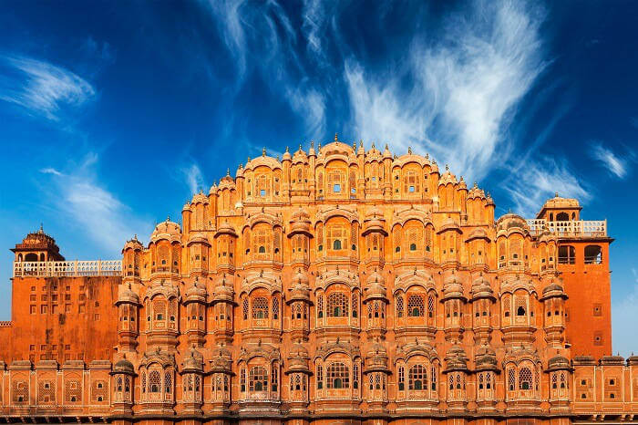

# RajPortal-Server
This is only a link based site 
<!DOCTYPE html>
<html lang="en">

<head>
    <meta charset="UTF-8">
    <meta name="viewport" content="width=device-width, initial-scale=1.0">
    <title>Document</title>
    <link rel="stylesheet" href="https://cdnjs.cloudflare.com/ajax/libs/font-awesome/4.7.0/css/font-awesome.min.css">
    
</head>

<body>

    <!-- Navigation Bar -->
    

        <a class="active" href="https://jansoochna.rajasthan.gov.in/index.php/kiosks-main/"><i class="fa fa-fw fa-home"></i>ई मित्र</a>
        <a href="https://jansoochna.rajasthan.gov.in/index.php/employment-main/"><i class="fa fa-fw fa-globe"></i>रोजगार</a>
        <a href="https://jansoochna.rajasthan.gov.in/index.php/sampark-main/"><i class="fa fa-fw fa-envelope"></i> संपर्क</a>
        <a href="https://jansoochna.rajasthan.gov.in/index.php/e-panchayat-main/"><i class="fa fa-fw fa-user"></i>ई- पंचायत</a>
        <a href="https://jansoochna.rajasthan.gov.in/index.php/rti-main/"><i class="fa fa-fw fa-search"></i>सूचना का अधिकार</a>
        
        
        
        

        <a class="active" href="#"><i class="fa fa-fw fa-home"></i> RajPortal-></a>
        <a href="https://sso.rajasthan.gov.in/register"><i class="fa fa-fw fa-user"></i>Sign Up</a>
        <a href="https://sso.rajasthan.gov.in/dashboard"><i class="fa fa-fw fa-user"></i> Sign in</a>

        <a href="https://searchsecurity.techtarget.com/definition/single-sign-on"><i class="fa fa-fw fa-search"></i>Search</a>

    

    

        <!-- 
Government Of Rajasthan</h1> -->
    

    <!-- Inside Icon -->
    

        <a href="javascript:void(0)" class="closebtn" onclick="closeNav()">&times;</a>
        

            <a href="http://sampark.rajasthan.gov.in"><i class="fa fa-fw fa-feedback"></i>About</a>
            <a href="https://docs.google.com/forms/d/e/1FAIpQLSeIbxFTioasoF2gkV0ZC0-TGrHD-L8FpT7owXS73y5IHHp9UA/viewform">Feedback</a>
            <a href="https://docs.google.com/forms/d/e/1FAIpQLSeIbxFTioasoF2gkV0ZC0-TGrHD-L8FpT7owXS73y5IHHp9UA/viewform">Suggestion</a>
            <a href="
          https://docs.google.com/forms/d/e/1FAIpQLSfi8V4DQYnesJi74B1jwmBTbupthXbSDzKOn3VN6yZo9V85wQ/viewform">Contact Me</a>
        

    

    &#9776; open

    

    

    

        <!-- Rajasthan Map -->

        

            

                <form action="https://www.google.co.in/maps/place/Rajasthan/@26.5674306,69.3774632,6z/data=!3m1!4b1!4m5!3m4!1s0x396a3efaf7e30e37:0xb52b9b4506c088e5!8m2!3d27.0238036!4d74.2179326">
                    
                    <button type="submit" style="padding: 1px;width: 250px;font-size: 30px;background-color: transparent;">Rajasthan Map</button></form>

                <form action="https://www.holidify.com/state/rajasthan/map-view.html">
                    
                    <button type="submit" style="padding: 1px;width: 250px;font-size: 30px;background-color: transparent;margin-top: 10px;">Tourist Map</form>
         
                <form action="https://www.tripadvisor.in/Attractions-g297665-Activities-Rajasthan.html">
                    
                    <button type="submit" style="padding: 1px;width: 250px;font-size: 30px;background-color: transparent;margin-top: 10px;">Top 10 Palace</form>
                     
                    

          

          
          
          
          
          

            
        

        
        

            
        

        
        
        
        
        
        
       
    

   
    
    

    
 
राजस्थान राज्य भारत के उत्तर-पश्चिम में स्थित सबसे खूबसूरत राज्यों में गिना जाता है। राजस्थान स्टेट लगभग 342,239 वर्ग किलोमीटर के क्षेत्र में फैला हुआ हैं और भारत का सबसे बड़ा राज्य है। राजस्थान की भूमि राजा-महाराजाओं की भूमि होने के साथ-साथ बहुत ही लोकप्रिय और ऐतिहासिक स्थान माना जाता हैं। राजस्थान में कई प्राचीन किले, स्मारक, प्रसिद्ध भवन राजस्थान की प्रसिद्धि के प्रमुख कारण है।

        राजस्थान अपनी रंगीन संस्कृति, खूबसूरत पहनावा, दिलचस्प कलाकृति और यहाँ के प्रसिद्ध व्यंजनों के लिए दुनियाभर में प्रसिद्ध हैं। राजस्थान में विशाल थार रेगिस्तान स्थित है जोकि भारत का सबसे बड़ा रेगिस्तान है और दुनिया के सबसे बड़े उष्णकटिबंधीय रेगिस्तानों में यह 18 वे नंबर पर है।
        
        

        <h2>Star Rating</h2>
        
        
        
        
        
      

    

    

      

      
 <h1 style="background-color:transparent">राजस्थान की राजधानी : -</h1>

      

        
      

        

            
 

            जयपुर शहर(पिंक सिटी) अपनी शाही किले, महलों, प्राचीन इमारतों और दुनिया के कई आकर्षक होटलों की वजह से राज्य का प्रमुख पर्यटन शहर है। जयपुर में स्थित कई विशाल किलों और महलों को देखने के लिए दुनिया भारत से यहां पर्यटक आते हैं। जयपुर की यात्रा के दौरान आप नीचे दिए गए पर्यटन स्थलों की सैर कर सकते हैं।

             बिरला मंदिर
             राम निवास उद्यान
             खाटू श्याम जी मंदिर
             जयगढ़ किला
             आमेर का किला
             सिटी पैलेस
             जल महल
             नाहरगढ़ किला
             जंतर मंतर
             हवा महल
             गलताजी मंदिर
             चोखी ढाणी

        

        
         

         
<h2>Loading...</h2> 

</body>
</html>
